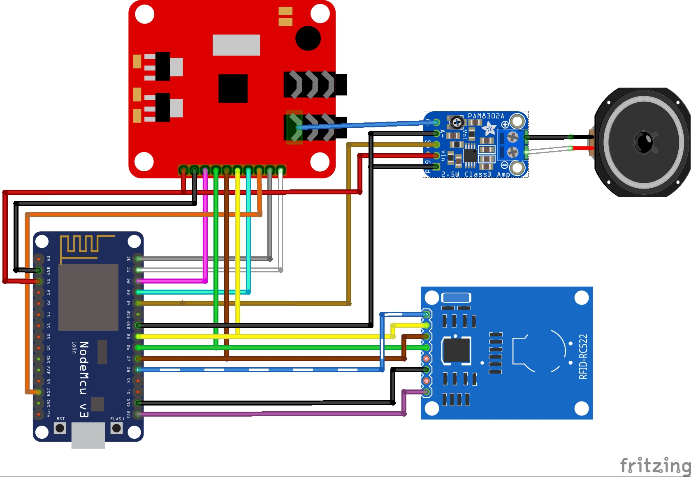
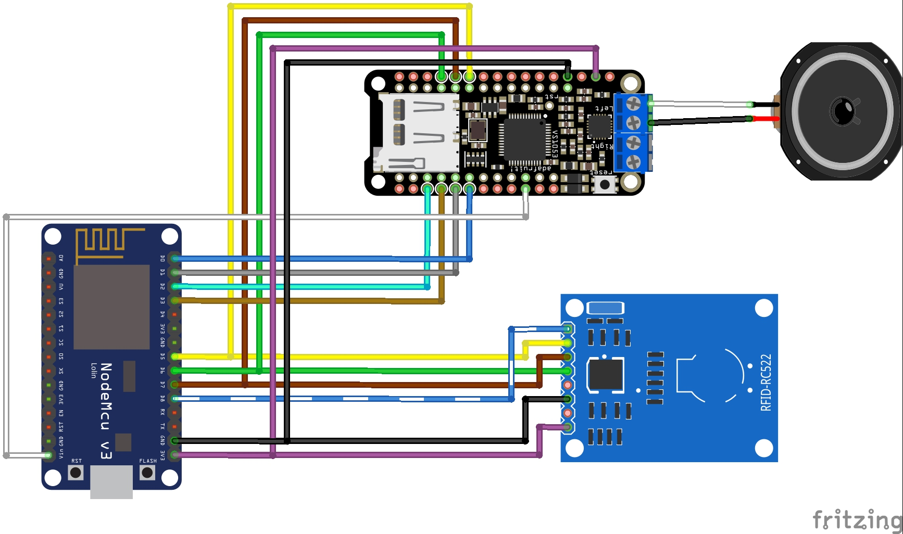

# RfidShelf
Make your shelf play MP3s!

Use some cheap hardware (Esp8266/NodeMcu, RC522, VS1053 MP3 breakout board) to create an RFID controlled MP3 (and more) shelf. Impression of the first prototype:

[(https://youtu.be/mNQsbTEaK-0 "RfidShelf in action")

This is how the first "test subject" reacted:

## The idea
When I was a little child I loved my tapes, vinyls and later CDs. Choosing my own music or listening to Pumuckl all day. Nowadays everything is available as MP3 which makes it hard for little kids to choose their own music. Since I wanted to give my son the same possibilities I decided to start this project:

Rfid cards can the be assigned a folder containing MP3 files on a SD card, played when the card is put on the shelf. Using some creativity (and/or the Internet and a printer) those cards can be customized to represent their content, giving the kid the ability to distinguish them. A WiFi web interface gives you the ability to manage the files on the shelf and to program the cards.

## Features
* Easy to use: kids proof!
* Safe: No wiring on the outside, just a USB cable going in
* Cheap: ~ 30€ depending on the parts you choose
* Easy to managed: Web interface to configure everything needed

## Repository structure
* /Fritzing contains the sources for the wiring diagram
* /RfidShelf Arduino/platformio sources for building the firmware
* /RfidShelf/build/ current firmware image
* /ShelfBoard KiCad source files for the shelf board pcb
* /ShelfBoard/gerber current shelf board gerber files

## Tools required
* Electric drill
* Hole saw (if you don't have one, you can [get it at ikea](http://www.ikea.com/us/en/catalog/products/20302332/) together with the shelf)
* Soldering iron
* Long, stable screw driver or something similar

## Hardware
I tried a variety of hardware combinations both focusing on being cheap and easy to assemble. Based on that I can recommend a few setups, depending on your budget and your ability/willingness to solder. Most items can be bought on Aliexpress for a few bucks, the links are only meant to be an example.

### Common for all:
Some light soldering is required to attach the pin headers to the MFRC-522

* [Shelf (All Ikea Lack Shelfs and even Tables should work, but I only tried the one linked) ~6€](http://www.ikea.com/de/de/catalog/products/50282177/)
* [NodeMcu (make sure to get correct version, because the vary in size!) ~2,50€](https://www.aliexpress.com/item/V3-Wireless-module-NodeMcu-4M-bytes-Lua-WIFI-Internet-of-Things-development-board-based-ESP8266-for/32554198757.html)
* [MFRC-522 Rfid Reader ~1,50€](https://www.aliexpress.com/item/Free-shipping-MFRC-522-RC522-RFID-RF-IC-card-sensor-module-to-send-S50-Fudan-card/1623810751.html)
* [3W 8Ohm In-Ceiling Speaker ~6,50€](http://www.ebay.de/itm/112275116606?_trksid=p2057872.m2749.l2649&ssPageName=STRK%3AMEBIDX%3AIT)
* [USB Connector ~1,50€](https://www.aliexpress.com/item/D-type-aluminum-USB-3-0-female-to-female-connector/32608847792.html)
* [Rfid Cards ~0,25€ each](http://www.ebay.de/itm/10pcs-NFC-thin-smart-card-tag-1k-S50-IC-13-56MHz-Read-Write-RFID-/172309355607?hash=item281e701c57)
* Micro USB Cable + USB Power Supply (Just use one from your old smart phone)
* Jumper Wires

### Cheap (~30€)
Disclaimer: I had some noise issues with this version, probably due to all the wires flying around.
Some more light soldering is required to attach the pin headers to the amplifier.
* [Base plate for NodeMcu (also available as a kit including the NodeMcu) ~1,50](https://www.aliexpress.com/item/Nodemcu-base-plate-Lua-WIFI-NodeMcu-development-board-ESP8266-serial-port/32678372845.html)
* [VS1053 MP3 + SD Board ~6,50€](https://www.aliexpress.com/item/VS1053-VS1053B-MP3-Module-Breakout-Board-With-SD-Card-Slot-VS1053B-Ogg-Real-time-Recording-For/32809994212.html)
* [PAM8302 Amplifier ~1,00€](https://www.aliexpress.com/item/CJMCU-832-PAM8302-2-5W-single-channel-Class-D-Audio-power-amplifier-module-PAM8302A-development-board/32708571731.html)
* SD Card (NOT a micro SD but a big one!)

### ShelfBoard based (~40€)
The ShelfBoard comes in 4 pack when ordered at PCBs.io, so if you build more shelves or share with someone else, the price is quite good. Components are the same as for the "cheap" version, but instead of the base plate use the following:
* [ShelfBoard (~10,00€)](https://PCBs.io/share/z7aNg).
* [2.54mm single row female pin header - 15 pin](https://www.aliexpress.com/item/Pitch-2-54mm-2-3-4-5-6-7-8-9-10-11-12-13-14/32793723098.html)
* [2.54mm single row right angle male pin header ](https://www.aliexpress.com/item/10Pcs-40Pin-2-54mm-Single-Row-Right-Angle-Pin-Header-Strip-kit/32664627220.html)
* [2.54 single row right angle female pin header - 10 pin](http://www.ebay.de/itm/Stk-5x-BUCHSENLEISTE-HEADER-10-polig-2-54mm-Abgewinkelt-Right-Angle-A1761-/262828334819?hash=item3d31ca1ee3:g:prkAAOSwImRYjcnX)

### Easy (~45€)
The Adafruit board offers a good sound quality and already has an amp on board. Be sure to by the correct board, there is also a version without the amp, but a phone jack instead!
* [Base plate for NodeMcu (also available as a kit including the NodeMcu) ~1,50](https://www.aliexpress.com/item/Nodemcu-base-plate-Lua-WIFI-NodeMcu-development-board-ESP8266-serial-port/32678372845.html)
* [Adafruit Music Maker FeatherWing w/ Amp ~30,00€](https://www.adafruit.com/product/3436)
* A MicroSD Card

## Wiring

(See /Fritzing folder for vector/svg version if this image)

## Build instructions
See [hardware instructions](hardware-instructions.md)

## Random Notes
* Instead of cards you can also use those blue key fob Rfid tags, like the one included in most MFRC-522 kits. Maybe you can "implant" it into a teddy or something similar.
* Neutrik NAUSB-W seems to be a great alternative for the USB port if manage to get it for a fair price at ebay. It fits a round whole and therefore is easier to mount into the shelf.

## Disclaimer
Everything in this project I did up to my best knowledge. Nevertheless this comes without guarantee. Do not hold me responsible in case something unexpected/undesired happens.

