# Hardware Instructions

Use the hole saw to create an opening for the speaker. For more stable mount use the 64mm drill/saw, although it makes it a little hard to install the hardware on the inside.
Make sure to put the hole on the _bottom_ of the shelf, it is very easy to get confused here. Also don't drill to deep or you'll damage the top of shelf.
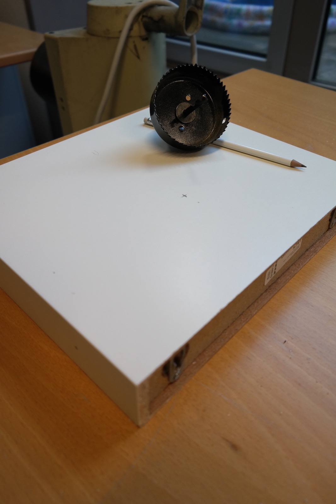

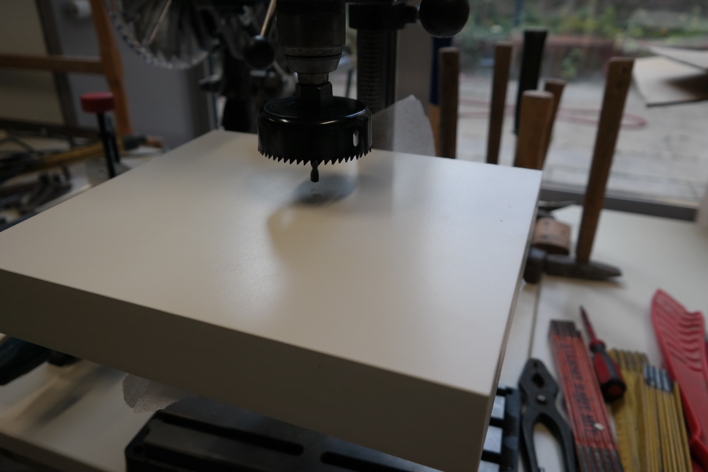

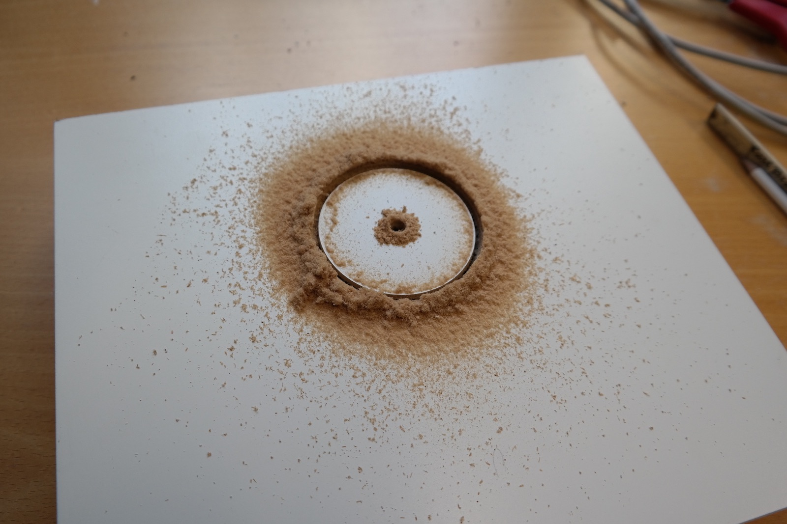

After sawing the hole use a screwdriver to open the shelf up.
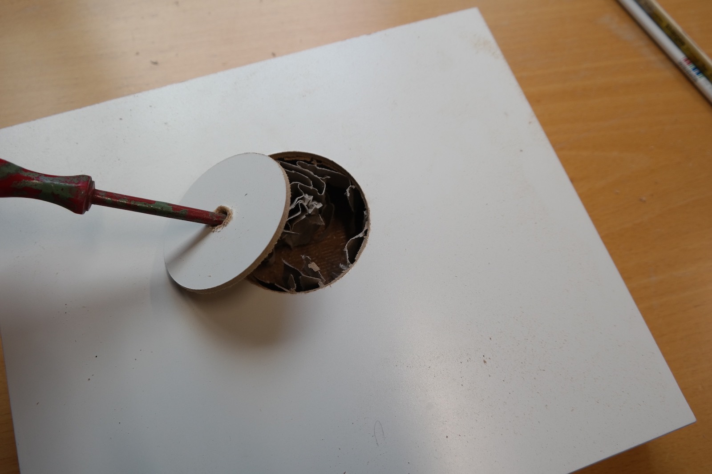

Now you can start to remove the paper from inside.
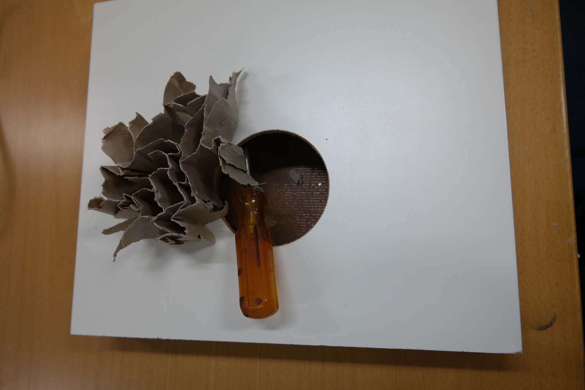

I recommend removing all the paper, even though it is quite a hassle. In my experience this does not affect the stability of the shelf.
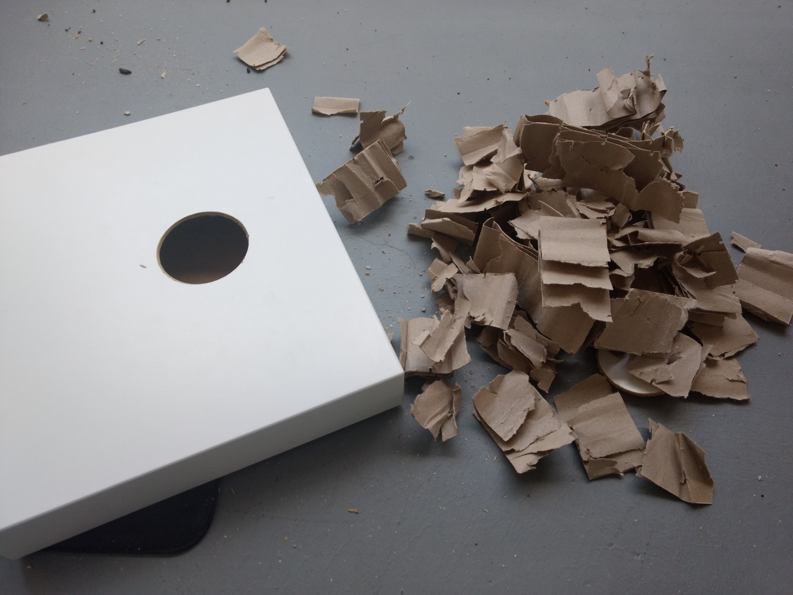

Drill a hole into the side of the shelf.
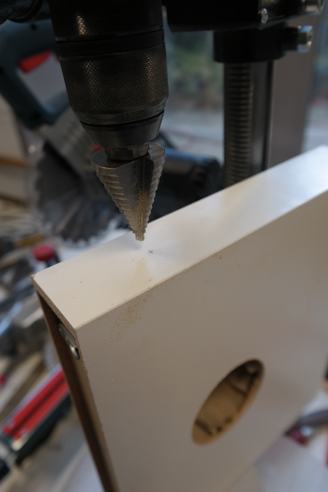

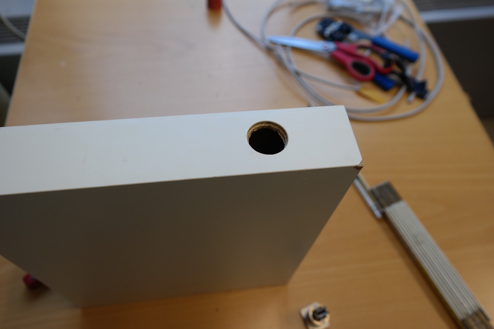

Put an USB wire through the shelf. Connect one end to the USB connector and keep the other end hanging out of the big hole.
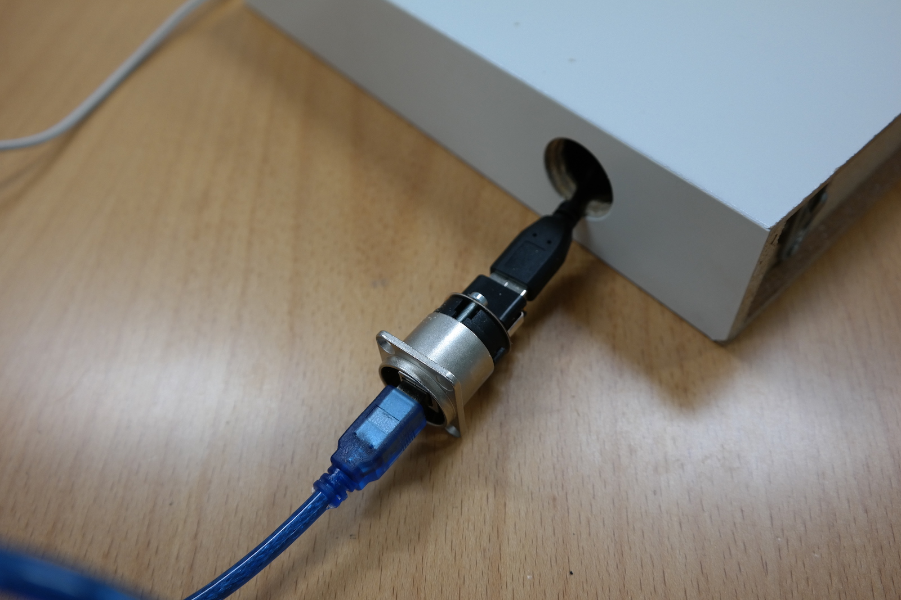

Place the usb connector. In most cases you can just plug it into the shelf. If it does not stick, use hot glue or some screws.
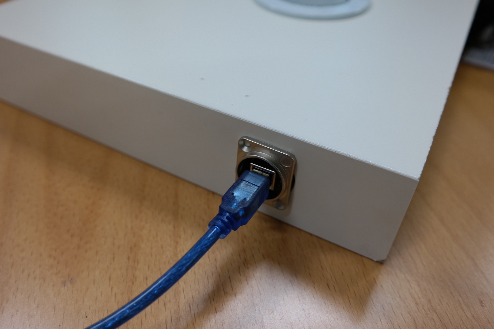

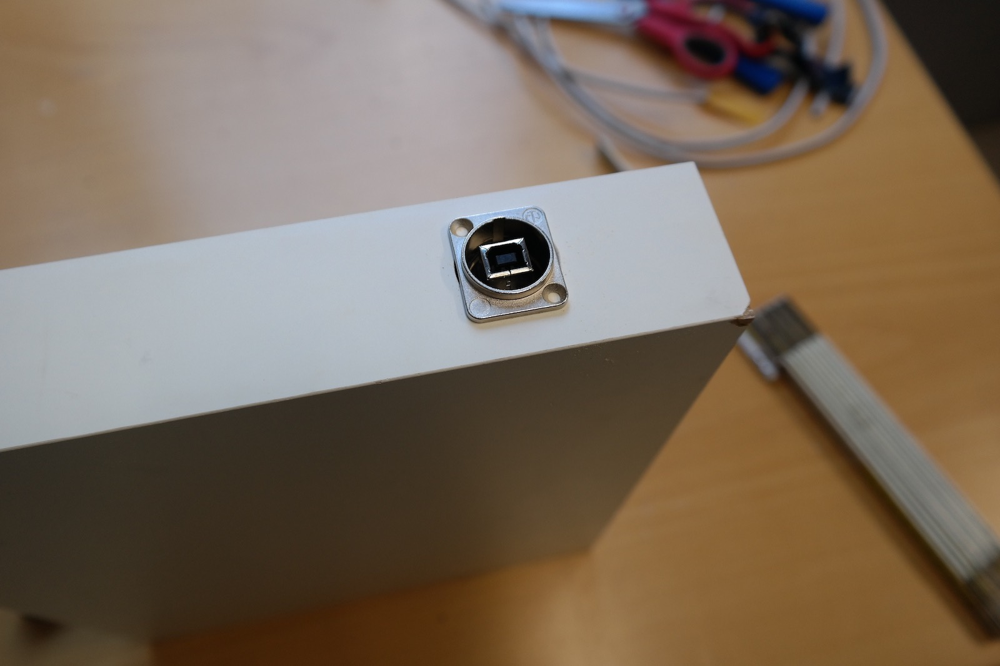

No it is time to put the board in. I used [plastic spacers](https://www.aliexpress.com/item/MTGATHER-100-PCS-HC-5-Nylon-Plastic-Stick-On-PCB-Spacer-Standoff-Locking-Snap-In-Posts/32794726696.html) to glue it in, but insulating tape probably also works. For easier installation, I removed the MP3 decoder board and plugged it back in, once the base board was mounted inside.
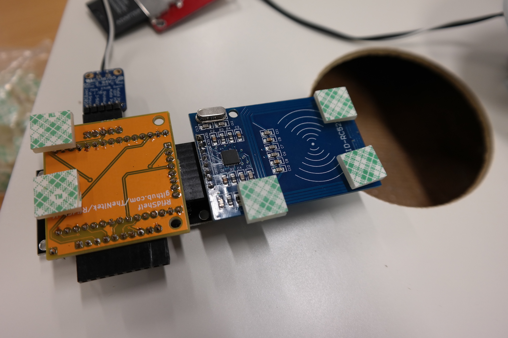

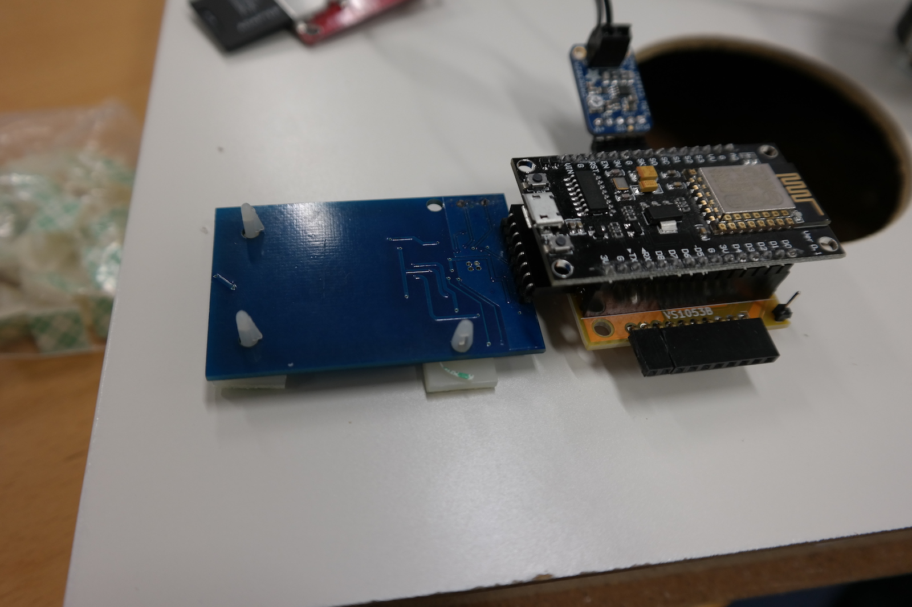

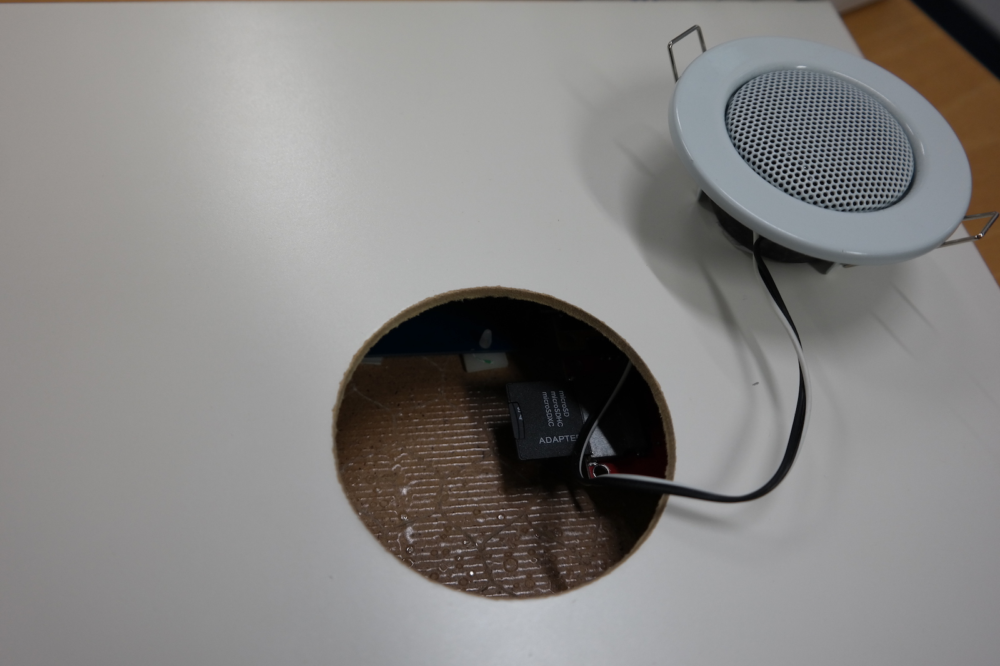

Now close the hole up by inserting the speaker. It should sit quite tight.
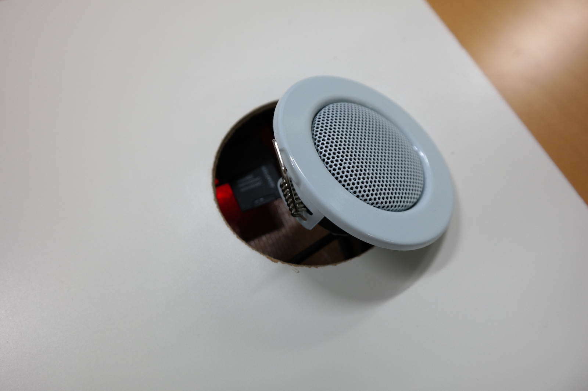

Now you are good to go!

Back to the [overview](README.md)
